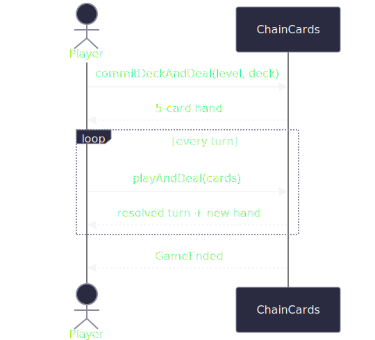

# Chain Cards

### A trading card game on Polkadot AssetHub

Nicolás Mayora — PBP Lisbon

---

## What was built

- Single-player **deck-builder** in the spirit of *Slay the Spire*
  - 20 cards · 3 levels · 15-card decks · 5-card hands · 5-card packs
- **Ownership, shuffling and hand validation live on-chain**; battle UI runs in the browser
- Players **trade cards** for tokens or for other cards
- Pack sales feed back into new content

---

## Why blockchain?

### The TCG economy is broken

- On traditional on-line TCG's you may spend money on cards, but **you don't own them**.
- Servers might get shut down at any time, and you'd lose access to your cards.
- On blockchain, **the cards are yours to keep**.
- Trading is completely open, the market organically finds its own equilibrium.

---

### What's actually unique here

- **True ownership** → cards are portable assets, not DB rows
- **Permissionless P2P trading** → card↔card or card↔token, no house
- **Provably fair play** → deck shuffle and hand dealing happen *on-chain*, not just ownership
- **Transparent drops** → booster randomness seeded from a future `blockhash`

---

## Architecture

---

## Gameplay flow

The player <strong>can never play a card that wasn't dealt</strong> — the contract rejects the call, so there is nothing to "hack" client-side.

---

# Next steps

- The obvious: More cards, more levels.
- Improve UX, so user doesn't have to individually sign each transaction.
- Make the trading system smarter and more flexible.
- Make the UI prettier :^)

---

## Try it!
##### `github.com/nico-mayora/polkadot-card-game`
